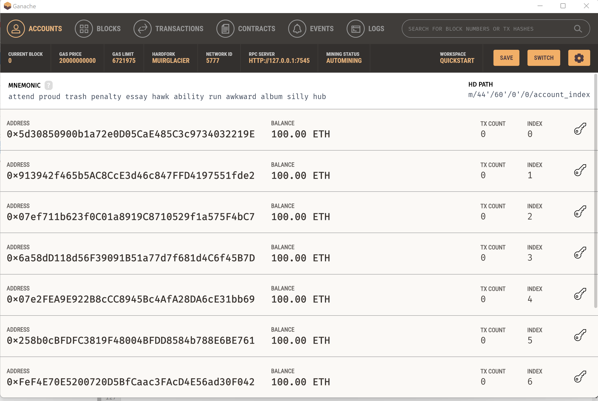
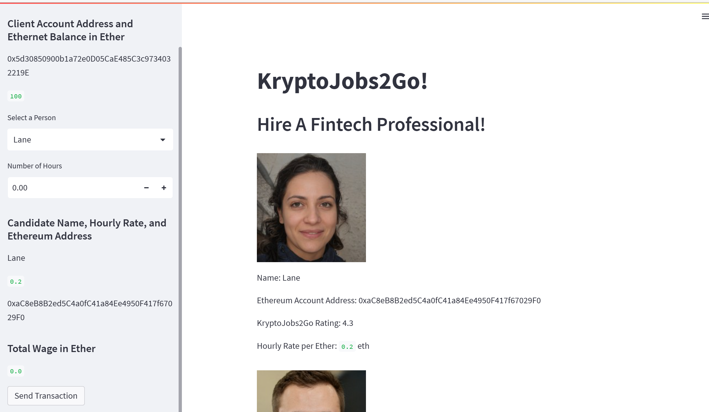
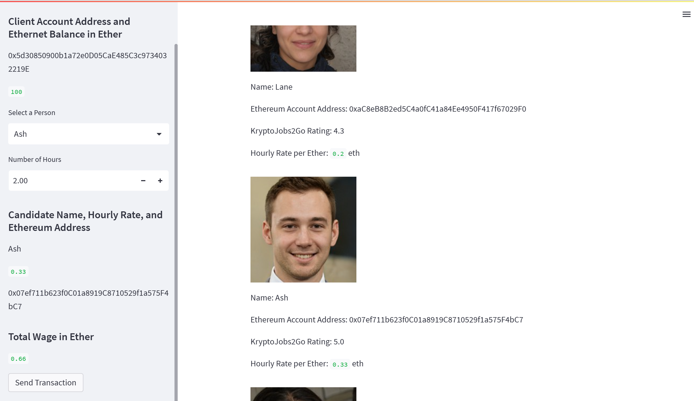
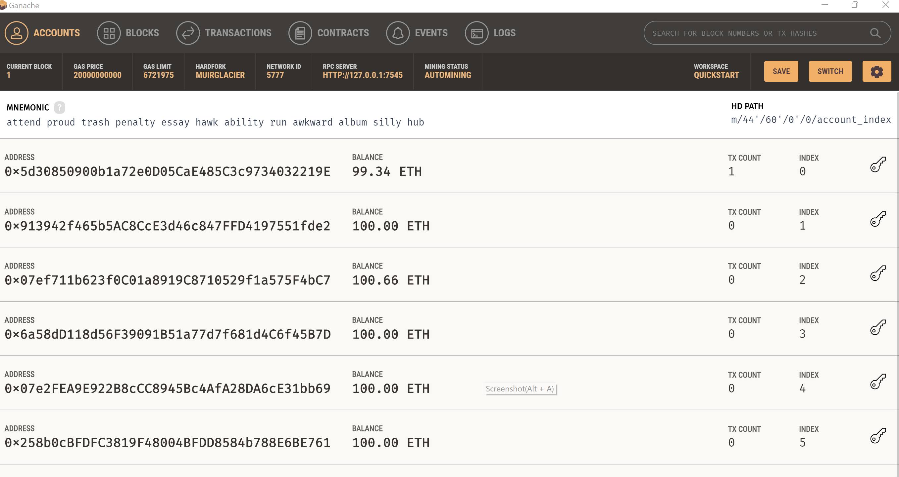
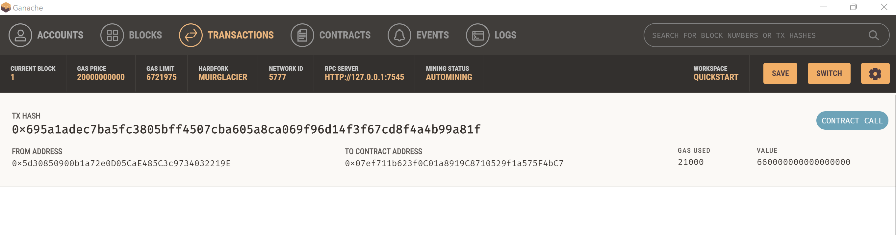
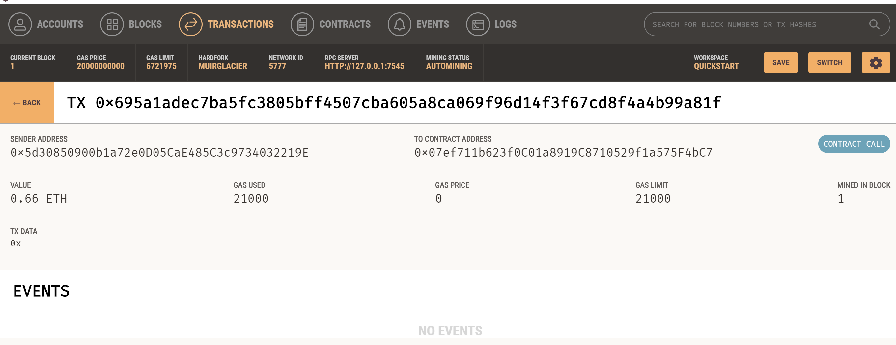

# Unit 19 Homework: Cryptocurrency Wallet

# Background

You work at a startup that is building a new and disruptive platform called KryptoJobs2Go. KryptoJobs2Go is an application that its customers can use to find fintech professionals from among a list of candidates, hire them, and pay them. As KryptoJobs2Go’s lead developer, you have been tasked with integrating the Ethereum blockchain network into the application in order to enable your customers to instantly pay the fintech professionals whom they hire with cryptocurrency.

In this Challenge, you will complete the code that enables your customers to send cryptocurrency payments to fintech professionals. To develop the code and test it out, you will assume the perspective of a KryptoJobs2Go customer who is using the application to find a fintech professional and pay them for their work.

# Initial Ganache Screenshot
- Sender Address: 0x5d30850900b1a72e0D05CaE485C3c9734032219E
- Receiver Address(Ash's address):
0x07ef711b623f0C01a8919C8710529f1a575F4bC7
- Both the sender and receiver's balances are 100 ETH

# After streamlit run krypto_jobs.py
- You can see the sender's address, and the candidates' addresses, hourly rates, ratings
- You can select a candidate, hours for the job and send the transaction by clicking "Send Transaction" button

# After select Ash and input 2 hours for the jobs

# After clicking the Send Transaction button 
## Streamlit screenshot
Displaying validated Transaction Hash

## Ganache screenshot
- Both the sender and the receiver's balances are updated after sending the transaction
- Sender's balance reduced 0.66 ETH

# Transaction Details after sending the transaction
- You can check the transaction information by choosing the 'TRANSACTION PAGE'
- Transaction page has information including: sender's address, receiver's address,amount that is sent, gas fee, transaction hash.

# Streamlit sender balance update after sending the transaction
Streamlit info (Sender's balance) updated after sending the transaction

    

# Recipient's address balance update

Receiver's balance increased after receiving 0.66 ETH

---

02-02-2023
